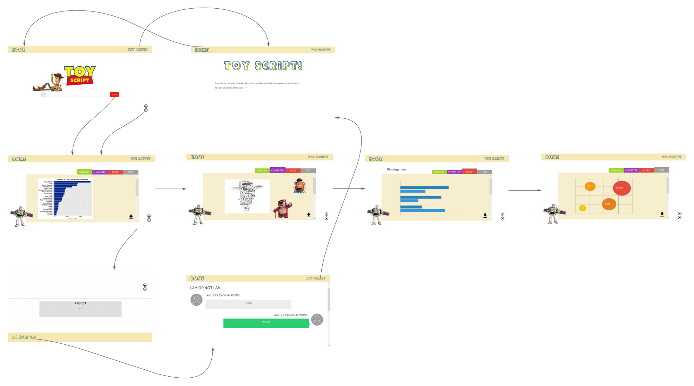

## 프로젝트 구성 안내

## 1. 프로젝트 소개

#### 사용하려는 데이터(제안된 데이터 중 하나 또는 선택한 다른 데이터 세트)를 명시, 이에 대한 설명
1. **Toy Story3 Script** PDF 파일 : **MVP 기능**을 구현할 때 분석 코드를 작성하기 위한 raw data로 사용합니다.
2. [imsdb](https://imsdb.com/) 사이트에서 대본 크롤링(Text) : 본 웹 서비스를 구현할 때 사용자가 입력한 영화의 타이틀을 기준으로 imsdb 사이트에서 대본을 크롤링하여 분석한 결과를 보여줍니다.
3. 사용자에게 대본(txt) 파일을 입력받아 분석한 결과를 보여줍니다.
      
#### 기술 스택

#### 웹서비스에 대한 자세한 개요

1. 사용자가 검색창에 영화 이름을 입력하거나 대본을 업로드합니다.
2. 서버에서 데이터를 처리하고 분석한 결과를 전송합니다.
3. 전송받은 데이터(분석 결과)를 시각화하여 사용자에게 보여줍니다.

## 2. 프로젝트 목표

#### 프로젝트 아이디어 동기
        
 제작할 영화를 선정하는 과정에서 영화 제작자는 많은 양의 대본을 검토해야합니다. "Pre--production"은 영화 촬영을 위한 준비작업을 뜻합니다. 다만 그 준비작업에서도 시나리오 선정, 제작비 펀딩은 개발 단계에 속합니다.     
개발 단계가 끝나고 제작을 위해 준비하는 일을 프리 프로덕션이라고 합니다. 이 단계에서 시나리오 분석, 시각화 작업, 배우 캐스팅, 리허설이 감독 몫, 스케줄을 짜고, 예산을 잡고, 감독과 제작팀을 구성하는 일 등이 제작자 몫입니다.     
이러한 프리 프로덕션 과정에서 시나리오를 분석하고 시각화하는 과정을 서비스로 제공함으로써, 감독과 제작자의 업무 효율을 높혀 주는 것이 우리 웹서비스의 목적입니다.

#### 문제를 해결하기 위한 특정 질문 명시        
대본 데이터를 이용해서 시나리오의 전체적인 틀을 분석해서 시각화하는 과정을 자동화할 수 있는가?

#### 데이터를 통해 탐색하려는 문제 :     

- 제작 스케쥴과 예산과 제작팀을 구성하는 제작자에게 도움을 줄 수 있는가?
  - 대본에 등장하는 장소를 파악하고, 등장빈도(중요도)를 분석(장면 별 촬영장도 정리 등의 분석결과 시각화를 통해 스케쥴 설정에 도움)
  - 대본에 등장하는 등장인물을 파악하고, 중요도 및 성격과 관계를 분석(주/조연 캐릭터 미리 파악, 추후 성격과 관계 데이터를 참고하여 배우 캐스팅에 도움)
  - 대본에 등장하는 시간대별 장면(Scene)과 등장인물 분석을 통해 영화의 분위기 추측   

## 3. 프로젝트 기능 설명

#### 주요 기능 (주된 활용성) 및 서브 기능

- 주요 기능 : 'GO' 버튼을 클릭하면 "요약","인물","장소","시간"에 대한 분석 결과를 탭으로 나누고 시각화하여 분석 결과를 한 눈에 파악하기 용이하도록 합니다.   
- 사용자 편의성 : 메인화면에서 분석 이외의 UI를 제거함으로써, 사용자가 웹에서 해야하는 일이 무엇인지 파악하기 쉽게 합니다.   
- 시각화 실용성 : 대본을 읽으며 일일이 파악하려면 틀릴수도 있고, 시간이 오래 걸리는 정보들을 시각화하여 제공합니다.   
- 서브 기능 : (미구현)분석 결과 PDF 다운로드 기능 제공 / 웹서비스에 대한 설명 페이지 / 서비스를 개발한 개발자들의 소개 페이지가 존재합니다.

#### 프로젝트만의 차별점, 기대 효과

- 프로젝트만의 차별점 : 영화 제작 단계 전의 새로운 대본 데이터에 대해서도(script role을 적용한 대본에 한해서) 동일한 분석 과정을 통해 대본 요약, 인물, 장소, 시간에 대한 분석 내용을 빠르게 시각화해서 파악할 수 있습니다.

- 기대효과 :
  - 사용자가 감독 혹은 제작자라면 프리 프로덕션 과정의 시간을 절약하고 대본의 전체적인 느낌을 빠르게 파악할 수 있습니다.
  - 추가 기능 구현을 통해 imsdb에 올라와있는 대본은 물론(크롤링), 나아가 사용자가 업로드한 대본에 대해서도 동일한 대본 분석이 가능합니다.(script role에 따라 쓰여진 대본에 한하여)

## 4. 프로젝트 구성도

<<<<<<< HEAD

=======

>>>>>>> 9e84384c53f57516474e2811dee8d672d9335794

## 5. 프로젝트 팀원 역할 분담

| 이름 | 담당 업무 |
| ------ | ------ |
| 김유나 | PM, 프론트엔드개발 |
| 김수연 | 프론트엔드개발 |
| 김수람 | 백엔드개발 |
| 노하람 | 데이터분석 |
| 이보람 | 데이터분석, 백엔드개발, 프론트엔드개발 |

**멤버별 responsibility**

1. 리더 

- 기획 단계: 구체적인 설계와 지표에 따른 프로젝트 제안서 작성
- 개발 단계: 팀원간의 일정 등 조율 + 프론트 개발
- 수정 단계: 기획, 스크럼 진행, 코치님 피드백 반영해서 수정, 발표 준비

2. 프론트엔드 

- 기획 단계: 큰 주제에서 문제 해결 아이디어 도출, 와이어프레임 작성
- 개발 단계: 와이어프레임을 기반으로 구현, 데이터 처리 및 시각화 담당, UI 디자인 완성
- 수정 단계: 피드백 반영해서 프론트 디자인 수정

 3. 백엔드 & 데이터 담당  

- 기획 단계: 데이터 수집, 기획 데이터 분석을 통해 해결하고자 하는 문제를 정의
- 개발 단계: 데이터 베이스 구축 및 API 활용, imsdb 대본 크롤링, txt형식 대본 분석 후 분석 결과 DB 저장, api를 통해 프론트에 시각화가 필요한 데이터 전달
- 수정 단계: 코치님 피드백 반영해서 분석 / 시각화 방식 수정, DB 모델링 수정

## 6. 버전
- 현재 미정

## 7. FAQ
- 없음
