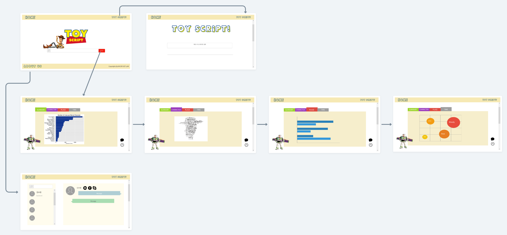

## 프로젝트 구성 안내

# 1. 프로젝트 소개

### 사용하려는 데이터(제안된 데이터 중 하나 또는 선택한 다른 데이터 세트)를 명시, 이에 대한 설명

1. **Toy Story3 Script** PDF 파일 : **MVP 기능**을 구현할 때 분석 코드를 작성하기 위한 raw data로 사용합니다.
2. [imsdb](https://imsdb.com/) 사이트에서 대본 크롤링(Text) : 본 웹 서비스를 구현할 때 사용자가 입력한 영화의 타이틀을 기준으로 imsdb 사이트에서 대본을 크롤링하여 분석한 결과를 보여줍니다.   

### 사용한 기술 스택, 라이브러리

1. 프론트엔드
   - React
   - react-router-dom
   - React-Bootstrap
   - react-chartjs-2
   - react-d3-graph
   - react-d3-wordcloud
   - axios
   - fort awesome   

2. 백엔드
   - Flask
   - Flask-Restful
   - Flask-SQLAlchemy
   - MySQL
   - NLTK

### 웹서비스에 대한 자세한 개요

1. 'Home' 페이지에서 사용자가 검색창에 영화 이름을 입력하면 서버 DB 저장된 영화 리스트에서 일치하는 결과를 찾습니다.
2. 분석 결과 데이터를 api로 전달받습니다.
3. 'Summary', 'Character', 'Place', 'Time' 탭의 각 분석내용을 react의 다양한 라이브러리를 활용해 시각화합니다.
4. 각 탭을 클릭하여 분석 내용을 확인할 수 있고, 분석 결과페이지를 카카오톡 공유하기 기능으로 공유할 수 있습니다.
5. 'Home' 페이지 우상단 'ToyScript?' 버튼을 클릭하면 웹서비스 개요와 사용방법을 확인할 수 있습니다.
6. 'Home' 페이지 좌하단 'AboutUs'버튼을 클릭하면 LAM OR NOT LAM 팀원 소개와 각 팀원의 Github, Gitlab, Blog에 접근할 수 있습니다.

# 2. 프로젝트 목표

### 프로젝트 아이디어 동기

 제작할 영화를 선정하는 과정에서 영화 제작자는 많은 양의 대본을 검토해야합니다. "Pre--production"은 영화 촬영을 위한 준비작업을 뜻합니다. 다만 그 준비작업에서도 시나리오 선정, 제작비 펀딩은 개발 단계에 속합니다.     
개발 단계가 끝나고 제작을 위해 준비하는 일을 프리 프로덕션이라고 합니다. 이 단계에서 시나리오 분석, 시각화 작업, 배우 캐스팅, 리허설이 감독 몫, 스케줄을 짜고, 예산을 잡고, 감독과 제작팀을 구성하는 일 등이 제작자 몫입니다.     
이러한 프리 프로덕션 과정에서 시나리오를 분석하고 시각화하는 과정을 서비스로 제공함으로써, 감독과 제작자의 업무 효율을 높혀 주는 것이 우리 웹서비스의 목적입니다.

### 문제를 해결하기 위한 특정 질문 명시 

대본 데이터를 이용해서 시나리오의 전체적인 틀을 분석해서 시각화하는 과정을 자동화할 수 있는가?

### 데이터를 통해 탐색하려는 문제 :     

- 제작 스케쥴과 예산과 제작팀을 구성하는 제작자에게 도움을 줄 수 있는가?
  - 대본에 등장하는 장소를 파악하고, 등장빈도(중요도)를 분석 : 장면 별 촬영장도 정리 등의 분석결과 시각화를 통해 스케쥴 설정에 도움
  - 대본에 등장하는 등장인물을 파악하고, 중요도 및 성격과 관계를 분석 : 주/조연 캐릭터 미리 파악, 추후 성격과 관계 데이터를 참고하여 배우 캐스팅에 도움
  - 대본에 등장하는 시간대별 장면(Scene)과 등장인물 분석을 통해 영화의 분위기 추측   

# 3. 프로젝트 기능 설명

### 주요 기능 (주된 활용성) 및 서브 기능

- 주요 기능 : 영화 타이틀 입력 후 'GO' 버튼을 클릭하면 "요약","인물","장소","시간"에 대한 분석 결과를 탭으로 나누고 시각화하여 분석 결과를 한 눈에 파악하기 용이하도록 합니다.  
- 사용자 편의성 : 메인화면에서 분석 이외의 UI를 제거함으로써, 사용자가 웹에서 해야하는 일이 무엇인지 파악하기 쉽게 합니다.   
- 시각화 실용성 : 대본을 읽으며 일일이 파악하려면 틀릴수도 있고, 시간이 오래 걸리는 정보들을 시각화하여 제공합니다.   
- 서브 기능 : 분석결과 카카오톡 공유하기 기능 / 웹서비스에 대한 설명 페이지 / 서비스를 개발한 개발자들의 소개 페이지가 존재합니다.

### 프로젝트만의 차별점, 기대 효과

- 프로젝트만의 차별점 : 다양한 영화에 대해서 동일한 분석 과정을 통해 대본 요약, 인물, 장소, 시간에 대한 분석 내용을 빠르게 시각화해서 파악할 수 있습니다.

- 기대효과 : 사용자가 감독 혹은 제작자라면 프리 프로덕션 과정의 시간을 절약하고 대본의 전체적인 느낌을 빠르게 파악할 수 있습니다.

# 4. 프로젝트 구성

- 화면

- ERD

- 시스템 아키텍쳐 

# 5. 프로젝트 팀원 역할 분담

| 이름   | 담당 업무                  |
| ------ | -------------------------- |
| 김유나 | PM, 프론트엔드개발         |
| 김수연 | 프론트엔드개발             |
| 김수람 | 백엔드개발                 |
| 노하람 | 데이터분석                 |
| 이보람 | 데이터분석, 프론트엔드개발 |

**멤버별 responsibility**

1. 리더 

- 기획 단계: 구체적인 설계와 지표에 따른 프로젝트 제안서 작성
- 개발 단계: 팀원간의 일정 등 조율 + 프론트 개발, 스크럼 진행 및 회의 내용 정리
- 수정 단계: 제안서를 코치님 피드백 반영해서 수정, 발표 준비

2. 프론트엔드 

- 기획 단계: 큰 주제에서 문제 해결 아이디어 도출, 와이어프레임 작성
- 개발 단계: 와이어프레임을 기반으로 구현, 시각화 담당, UI 디자인 완성
- 수정 단계: 피드백 반영해서 프론트 디자인 수정, 차트 종류 및 옵션 수정

  3. 백엔드 & 데이터 담당  

- 기획 단계: 데이터 수집, 기획 데이터 분석을 통해 해결하고자 하는 문제를 정의
- 개발 단계: 데이터 베이스 구축 및 API 활용, imsdb 대본 크롤링, txt형식 대본 분석 후 분석 결과 DB 저장, api를 통해 프론트에 시각화가 필요한 데이터 전달, 데이터 처리 및 시각화 담당
- 수정 단계: api 수정, DB 모델링 수정, 대본 전처리 과정 수정 

# 6. 프로젝트 명세 및 버전

- [프로젝트 제안서](https://docs.google.com/document/d/1qJ_oNsFKahh1kOHVWX_LQd_YqQwb0KIl3PlYwNtnXiE/edit#)
- [API 설계서](https://documenter.getpostman.com/view/5729975/TzCV2jQK)
- [기능 명세서](https://www.notion.so/12723e6587fb479f83d41a823a7b268d?v=c968a118e8204ba99c86255856b89dce)
- v1.0 : 2021.04.17 00:00 배포

# 7. 카테고리별 포함된 내용

- 요약 탭(`Summary`) 
  - 대본의 저자
  - 총 등장인물 수
  - 총 등장하는 장소 수
  - 총 등장하는 시간대 수
- 인물 탭(`Character`) 
  - 자주 등장하는 인물 Top 5
  - Top5 인물들의 감정 분석 결과
  - 등장인물간 관계도
  - Top5 등장인물이 자주 사용하는 단어 (워드 클라우드)
- 장소 탭(`Place`) 
  - 장소별 등장횟수 (`장소 예. KEVIN'S RESTAURANT 등` ) 
  - 가장 많이 나온 장소 Top 5
  - 각 장소에 해당하는 씬 넘버
  - 장소별 등장인물의 출연 빈도
- 시간 탭(`Time`)
  - 시간대별 등장횟수 (`시간대 예. DAY, NIGHT, TWILIGHT 등` ) 
  - 가장 많이 나온 시간대 Top 5 
  - 각 시간대에 해당하는 씬 넘버
  - 시간대별 등장인물의 출연 빈도

# 8. FAQ

1. 시간대 별 정보가 이 서비스의 타겟 유저에게 필요할까요?

   [답변] 네! 어떤 씬이 어떤 시간대에 많이 나오는지와 같은 정보는 영화 감독에게 꼭 필요한 정보입니다. 영화 제작에서 가장 중요한 건 예산인데요. 촬영 장소, 촬영 시간대, 또는 촬영 날의 날씨 등이 예산에 큰 영향을 미치는 변수가 됩니다. 저희 서비스를 이용해 시간대별 정보를 미리 알 수 있다면, 촬영 스케줄을 짤 때도 좀 더 효율적으로 짤 수 있겠죠!

2. 아무 영화나 입력해도 다 분석되나요?

   [답변] 현재 구현된 기능에서는 imsDB사이트에 등록된 영화 중 분석 가능한 형식의 대본을 가진 영화에 한에서만 분석 결과를 확인하실 수 있습니다

3. 개봉한 영화를 분석해서 사용자가 얻는게 무엇인가요?

   [답변] 스크립트 산업 표준(예시 : [https://www.storysense.com/format/dialogue.htm](https://www.storysense.com/format/dialogue.htm))을 따른 대본이라면, 새로운 대본이라도 분석이 가능합니다!

4. 탭을 구분해둔 이유가 있을까요?

   [답변] 대본에서 추출할 수 있는 다양한 정보를 크게 요약', '인물', '장소, '시간대'로 묶어 사용자가 해당 정보를 파악하기 용이하게 만드고자 했습니다!

5. 추후에 어떤 방향으로 서비스 확장이 가능할지?

   [답변] 이미 개봉한 영화의 대본 분석 결과를 알려주는 것보다 제작 전의 대본 분석 결과를 알려주고자 함이 TOYSCRIPT가 추구하고자 하는 방향입니다. 따라서 영화제목 검색 창 이외에 형식에 맞춘 대본 파일을 바로 업로드하면 분석 결과를 확인할 수 있는 서비스로 확장 가능하다고 생각합니다.

---

출처: 엘리스 AI 트랙 1기 https://aitrack.elice.io/
